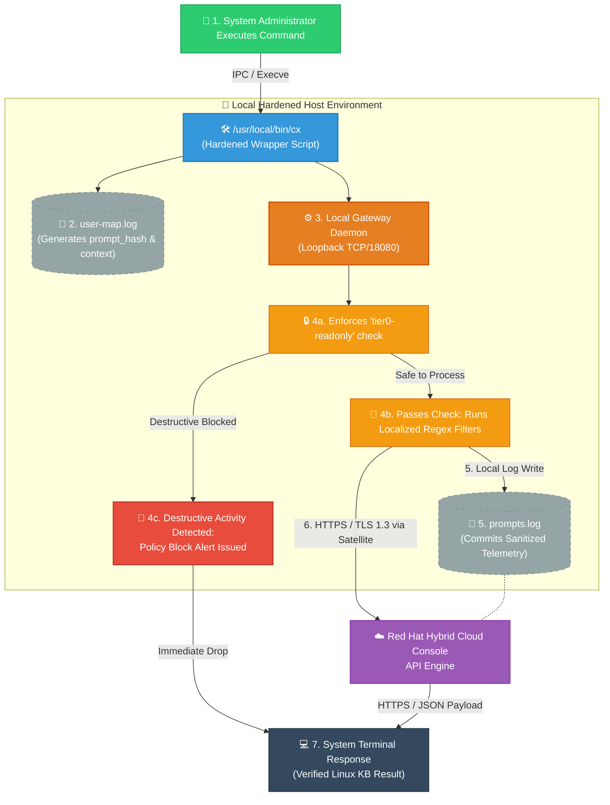

```mermaid
graph TD
    %% Styling definitions
    classDef user fill:#2ecc71,stroke:#27ae60,stroke-width:2px,color:#fff;
    classDef local fill:#3498db,stroke:#2980b9,stroke-width:2px,color:#fff;
    classDef daemon fill:#e67e22,stroke:#d35400,stroke-width:2px,color:#fff;
    classDef subEngine fill:#f39c12,stroke:#d35400,stroke-width:1px,color:#fff;
    classDef cloud fill:#9b59b6,stroke:#8e44ad,stroke-width:2px,color:#fff;
    classDef terminal fill:#34495e,stroke:#2c3e50,stroke-width:2px,color:#fff;
    classDef log fill:#95a5a6,stroke:#7f8c8d,stroke-width:1px,color:#fff,stroke-dasharray: 5 5;
    classDef alert fill:#e74c3c,stroke:#c0392b,stroke-width:2px,color:#fff;

    %% Workflow Nodes
    Admin[👤 1. System Administrator Executes Command]:::user
    
    subgraph LocalHost ["🏡 Local Hardened Host Environment"]
        Wrapper["🛠️ /usr/local/bin/cx<br>(Hardened Wrapper Script)"]:::local
        UserLog[("📝 2. user-map.log<br>(Generates prompt_hash & context)")]:::log
        
        Daemon["⚙️ 3. Local Gateway Daemon<br>(Loopback TCP/18080)"]:::daemon
        Check1["🔒 4a. Enforces 'tier0-readonly' check"]:::subEngine
        
        %% Core Security Decision Layer
        Check2["🧹 4b. Passes Check: Runs Localized Regex Filters"]:::subEngine
        FailBlock["🚨 4c. Destructive Activity Detected:<br>Policy Block Alert Issued"]:::alert
        
        PromptLog[("📝 5. prompts.log<br>(Commits Sanitized Telemetry)")]:::log
    end

    %% External Infrastructure (Unnested to allow crisp horizontal spacing)
    RHCloud["☁️ Red Hat Hybrid Cloud Console<br>API Engine"]:::cloud
    Response["💻 7. System Terminal Response<br>(Verified Linux KB Result)"]:::terminal

    %% Main Central Spine Flow
    Admin -->|IPC / Execve| Wrapper
    Wrapper --> UserLog
    Wrapper --> Daemon
    Daemon --> Check1
    
    %% Split Branches
    Check1 -->|Destructive Blocked| FailBlock
    Check1 -->|Safe to Process| Check2
    
    %% Left Side Drop For Blocked Execution
    FailBlock -->|Immediate Drop| Response
    
    %% Right Side Outputs (Split Left and Right beneath 4b)
    Check2 -->|5. Local Log Write| PromptLog
    Check2 -->|6. HTTPS / TLS 1.3 via Satellite| RHCloud
    
    %% Final Resolution Path
    RHCloud -->|HTTPS / JSON Payload| Response

    %% Hard Constraint Rule: Pushes Cloud engine to the right of the log file
    PromptLog -.- RHCloud
```
