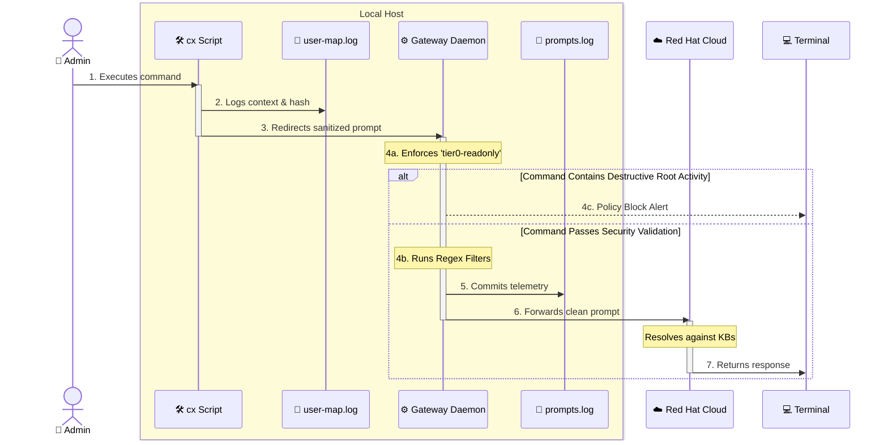

```mermaid
sequenceDiagram
    actor Admin as 👤 Admin
    box rgb(254, 251, 216) Local Host
        participant Wrapper as 🛠️ cx Script
        participant Log1 as 📝 user-map.log
        participant Daemon as ⚙️ Gateway Daemon
        participant Log2 as 📝 prompts.log
    end
    participant Cloud as ☁️ Red Hat Cloud
    participant Term as 💻 Terminal

    Admin->>Wrapper: 1. Executes command
    activate Wrapper
    Wrapper->>Log1: 2. Logs context & hash
    Wrapper->>Daemon: 3. Redirects sanitized prompt
    deactivate Wrapper
    
    activate Daemon
    Note over Daemon: 4a. Enforces 'tier0-readonly'
    alt Command Contains Destructive Root Activity
        Daemon-->>Term: 4c. Policy Block Alert
    else Command Passes Security Validation
        Note over Daemon: 4b. Runs Regex Filters
        Daemon->>Log2: 5. Commits telemetry
        Daemon->>Cloud: 6. Forwards clean prompt
        deactivate Daemon
        
        activate Cloud
        Note over Cloud: Resolves against KBs
        Cloud->>Term: 7. Returns response
        deactivate Cloud
    end
```
