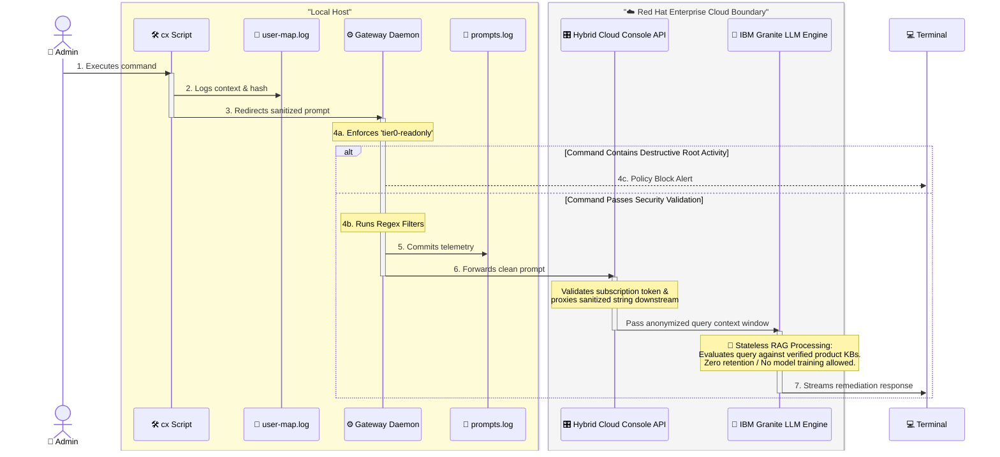

```mermaid
sequenceDiagram
    actor Admin as 👤 Admin
    
    box rgb(254, 251, 216) "Local Host"
        participant Wrapper as 🛠️ cx Script
        participant Log1 as 📝 user-map.log
        participant Daemon as ⚙️ Gateway Daemon
        participant Log2 as 📝 prompts.log
    end
    
    box rgb(245, 245, 245) "☁️ Red Hat Enterprise Cloud Boundary"
        participant Cloud as 🎛️ Hybrid Cloud Console API
        participant LLM as 🤖 IBM Granite LLM Engine
    end
    
    participant Term as 💻 Terminal

    Admin->>Wrapper: 1. Executes command
    activate Wrapper
    Wrapper->>Log1: 2. Logs context & hash
    Wrapper->>Daemon: 3. Redirects sanitized prompt
    deactivate Wrapper
    
    activate Daemon
    Note over Daemon: 4a. Enforces 'tier0-readonly'
    alt Command Contains Destructive Root Activity
        Daemon-->>Term: 4c. Policy Block Alert
    else Command Passes Security Validation
        Note over Daemon: 4b. Runs Regex Filters
        Daemon->>Log2: 5. Commits telemetry
        Daemon->>Cloud: 6. Forwards clean prompt
        deactivate Daemon
        
        activate Cloud
        Note over Cloud: Validates subscription token &<br>proxies sanitized string downstream
        Cloud->>LLM: Pass anonymized query context window
        deactivate Cloud
        
        activate LLM
        Note over LLM: 🧠 Stateless RAG Processing:<br>Evaluates query against verified product KBs.<br>Zero retention / No model training allowed.
        LLM->>Term: 7. Streams remediation response
        deactivate LLM
    end
```
