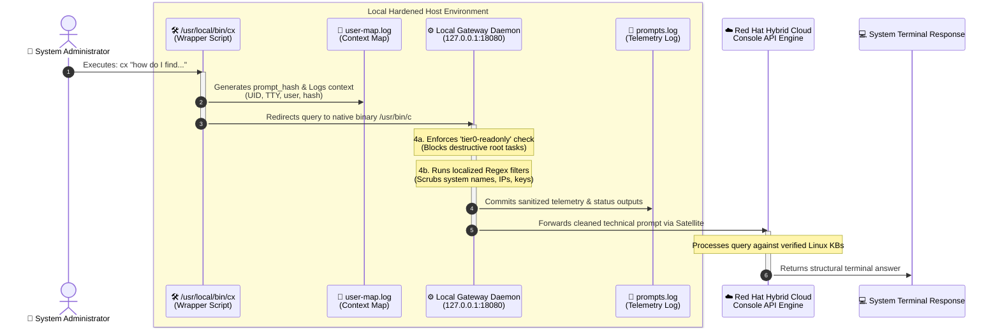

```mermaid
sequenceDiagram
    autonumber
    actor Admin as 👤 System Administrator
    box rgb(254, 251, 216) Local Hardened Host Environment
        participant Wrapper as 🛠️ /usr/local/bin/cx<br>(Wrapper Script)
        participant Log1 as 📝 user-map.log<br>(Context Map)
        participant Daemon as ⚙️ Local Gateway Daemon<br>(127.0.0.1:18080)
        participant Log2 as 📝 prompts.log<br>(Telemetry Log)
    end
    participant Cloud as ☁️ Red Hat Hybrid Cloud<br>Console API Engine
    participant Terminal as 💻 System Terminal Response

    Admin->>Wrapper: Executes: cx "how do I find..."
    activate Wrapper
    Wrapper->>Log1: Generates prompt_hash & Logs context<br>(UID, TTY, user, hash)
    Wrapper->>Daemon: Redirects query to native binary /usr/bin/c
    deactivate Wrapper
    
    activate Daemon
    Note over Daemon: 4a. Enforces 'tier0-readonly' check<br>(Blocks destructive root tasks)
    Note over Daemon: 4b. Runs localized Regex filters<br>(Scrubs system names, IPs, keys)
    Daemon->>Log2: Commits sanitized telemetry & status outputs
    Daemon->>Cloud: Forwards cleaned technical prompt via Satellite
    deactivate Daemon
    
    activate Cloud
    Note over Cloud: Processes query against verified Linux KBs
    Cloud->>Terminal: Returns structural terminal answer
    deactivate Cloud
```
