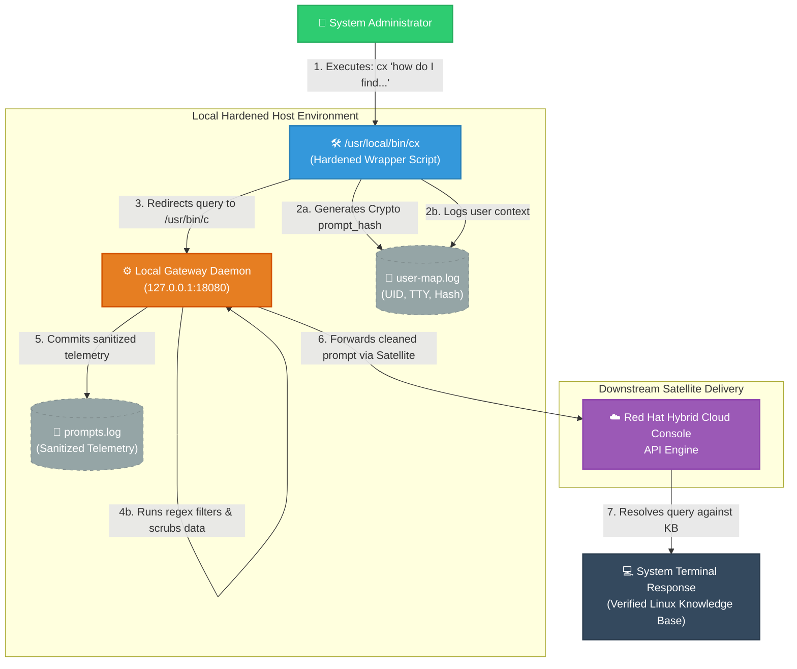

```mermaid
graph TD
    %% Styling definitions
    classDef user fill:#2ecc71,stroke:#27ae60,stroke-width:2px,color:#fff;
    classDef local fill:#3498db,stroke:#2980b9,stroke-width:2px,color:#fff;
    classDef daemon fill:#e67e22,stroke:#d35400,stroke-width:2px,color:#fff;
    classDef cloud fill:#9b59b6,stroke:#8e44ad,stroke-width:2px,color:#fff;
    classDef terminal fill:#34495e,stroke:#2c3e50,stroke-width:2px,color:#fff;
    classDef log fill:#95a5a6,stroke:#7f8c8d,stroke-width:1px,color:#fff,stroke-dasharray: 5 5;

    %% Workflow Nodes
    Admin[👤 System Administrator]:::user
    
    subgraph Local Host [Local Hardened Host Environment]
        Wrapper["🛠️ /usr/local/bin/cx<br>(Hardened Wrapper Script)"]:::local
        Daemon["⚙️ Local Gateway Daemon<br>(127.0.0.1:18080)"]:::daemon
        
        %% Audit Logs
        UserLog[("📝 user-map.log<br>(UID, TTY, Hash)")]:::log
        PromptLog[("📝 prompts.log<br>(Sanitized Telemetry)")]:::log
    end

    subgraph Red Hat Infrastructure [Downstream Satellite Delivery]
        RHCloud["☁️ Red Hat Hybrid Cloud Console<br>API Engine"]:::cloud
    end

    Response["💻 System Terminal Response<br>(Verified Linux Knowledge Base)"]:::terminal

    %% Connectivity & Data Flow
    Admin -->|1. Executes: cx 'how do I find...'| Wrapper
    
    Wrapper -->|2a. Generates Crypto prompt_hash| UserLog
    Wrapper -->|2b. Logs user context| UserLog
    Wrapper -->|3. Redirects query to /usr/bin/c| Daemon
    
    Daemon -->|4a. Enforces tier0-readonly check| Daemon
    Daemon -->|4b. Runs regex filters & scrubs data| Daemon
    Daemon -->|5. Commits sanitized telemetry| PromptLog
    
    Daemon -->|6. Forwards cleaned prompt via Satellite| RHCloud
    RHCloud -->|7. Resolves query against KB| Response
```
