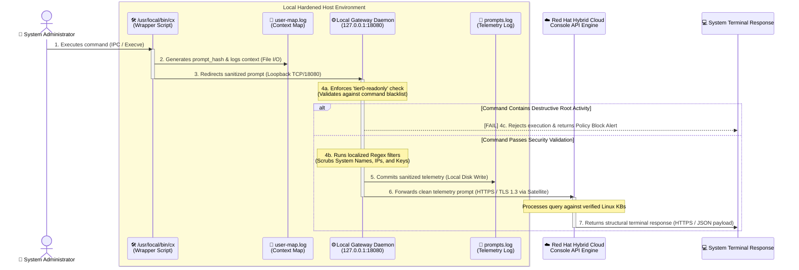

```mermaid
sequenceDiagram
    actor Admin as 👤 System Administrator
    box rgb(254, 251, 216) Local Hardened Host Environment
        participant Wrapper as 🛠️ /usr/local/bin/cx<br>(Wrapper Script)
        participant Log1 as 📝 user-map.log<br>(Context Map)
        participant Daemon as ⚙️ Local Gateway Daemon<br>(127.0.0.1:18080)
        participant Log2 as 📝 prompts.log<br>(Telemetry Log)
    end
    participant Cloud as ☁️ Red Hat Hybrid Cloud<br>Console API Engine
    participant Terminal as 💻 System Terminal Response

    Admin->>Wrapper: 1. Executes command (IPC / Execve)
    activate Wrapper
    Wrapper->>Log1: 2. Generates prompt_hash & logs context (File I/O)
    Wrapper->>Daemon: 3. Redirects sanitized prompt (Loopback TCP/18080)
    deactivate Wrapper
    
    activate Daemon
    Note over Daemon: 4a. Enforces 'tier0-readonly' check<br>(Validates against command blacklist)
    
    alt Command Contains Destructive Root Activity
        Daemon-->>Terminal: [FAIL] 4c. Rejects execution & returns Policy Block Alert
    else Command Passes Security Validation
        Note over Daemon: 4b. Runs localized Regex filters<br>(Scrubs System Names, IPs, and Keys)
        Daemon->>Log2: 5. Commits sanitized telemetry (Local Disk Write)
        Daemon->>Cloud: 6. Forwards clean telemetry prompt (HTTPS / TLS 1.3 via Satellite)
        deactivate Daemon
        
        activate Cloud
        Note over Cloud: Processes query against verified Linux KBs
        Cloud->>Terminal: 7. Returns structural terminal response (HTTPS / JSON payload)
        deactivate Cloud
    end
```
