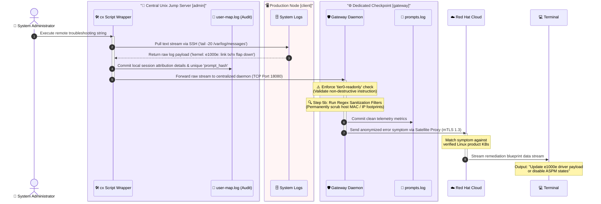

```mermaid
sequenceDiagram
    autonumber
    actor Admin as 👤 System Administrator
    
    box rgb(240, 235, 255) "🚀 Central Unix Jump Server [admin]"
        participant cx as 🛠️ cx Script Wrapper
        participant Log1 as 📝 user-map.log (Audit)
    end

    box rgb(255, 245, 245) "🖥️ Production Node [client]"
        participant Target as 🗄️ System Logs
    end
    
    box rgb(240, 235, 255) "⚙️ Dedicated Checkpoint [gateway]"
        participant GW as 🛡️ Gateway Daemon
        participant Log2 as 📝 prompts.log
    end
    
    participant Cloud as ☁️ Red Hat Cloud
    participant Term as 💻 Terminal

    Admin->>cx: Execute remote troubleshooting string
    activate cx
    cx->>Target: Pull text stream via SSH ('tail -20 /var/log/messages')
    Target-->>cx: Return raw log payload ('kernel: e1000e: link tx/rx flap down')
    cx->>Log1: Commit local session attribution details & unique 'prompt_hash'
    cx->>GW: Forward raw stream to centralized daemon (TCP Port 18080)
    deactivate cx
    
    activate GW
    Note over GW: ⚠️ Enforce 'tier0-readonly' check<br>(Validate non-destructive instruction)
    Note over GW: 🔍 Step 5b: Run Regex Sanitization Filters<br>(Permanently scrub host MAC / IP footprints)
    GW->>Log2: Commit clean telemetry metrics
    GW->>Cloud: Send anonymized error symptom via Satellite Proxy (mTLS 1.3)
    deactivate GW
    
    activate Cloud
    Note over Cloud: Match symptom against<br>verified Linux product KBs
    Cloud->>Term: Stream remediation blueprint data stream
    deactivate Cloud
    Note over Term: Output: "Update e1000e driver payload<br>or disable ASPM states"
```
