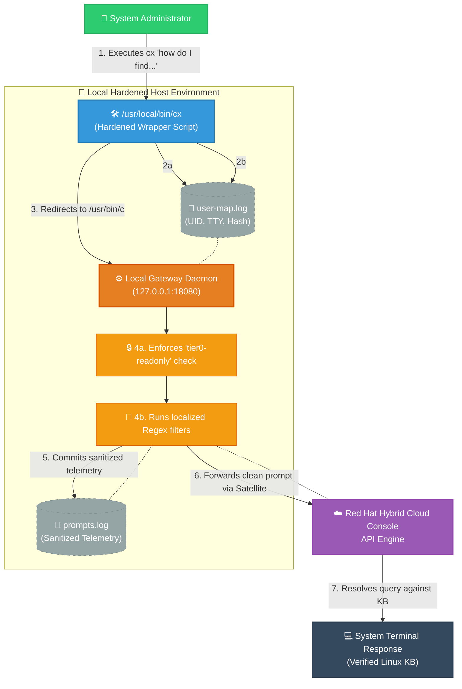

```mermaid
graph TD
    %% Styling definitions
    classDef user fill:#2ecc71,stroke:#27ae60,stroke-width:2px,color:#fff;
    classDef local fill:#3498db,stroke:#2980b9,stroke-width:2px,color:#fff;
    classDef daemon fill:#e67e22,stroke:#d35400,stroke-width:2px,color:#fff;
    classDef subEngine fill:#f39c12,stroke:#d35400,stroke-width:1px,color:#fff;
    classDef cloud fill:#9b59b6,stroke:#8e44ad,stroke-width:2px,color:#fff;
    classDef terminal fill:#34495e,stroke:#2c3e50,stroke-width:2px,color:#fff;
    classDef log fill:#95a5a6,stroke:#7f8c8d,stroke-width:1px,color:#fff,stroke-dasharray: 5 5;

    %% Workflow Nodes
    Admin[👤 System Administrator]:::user
    
    subgraph LocalHost ["🏡 Local Hardened Host Environment"]
        %% Column 1: Logging Databases (Left Side)
        UserLog[("📝 user-map.log<br>(UID, TTY, Hash)")]:::log
        PromptLog[("📝 prompts.log<br>(Sanitized Telemetry)")]:::log

        %% Column 2: Central Execution Spine (Center)
        Wrapper["🛠️ /usr/local/bin/cx<br>(Hardened Wrapper Script)"]:::local
        Daemon["⚙️ Local Gateway Daemon<br>(127.0.0.1:18080)"]:::daemon
        Check1["🔒 4a. Enforces 'tier0-readonly' check"]:::subEngine
        Check2["🧹 4b. Runs localized Regex filters"]:::subEngine
    end

    %% Column 3: External Systems (Right Side)
    RHCloud["☁️ Red Hat Hybrid Cloud Console<br>API Engine"]:::cloud
    Response["💻 System Terminal Response<br>(Verified Linux KB)"]:::terminal

    %% 1. Top Entry
    Admin -->|1. Executes cx 'how do I find...'| Wrapper

    %% 2. First Stage: Wrapper Execution & Context Logging
    Wrapper -->|3. Redirects to /usr/bin/c| Daemon
    Wrapper -->|2a| UserLog
    Wrapper -->|2b| UserLog

    %% 3. Second Stage: Internal Middleware Chain (Forces a straight downward spine)
    Daemon --> Check1
    Check1 --> Check2

    %% 4. Third Stage: Outputs and Exit Routes
    Check2 -->|5. Commits sanitized telemetry| PromptLog
    Check2 -->|6. Forwards clean prompt via Satellite| RHCloud

    %% 5. Final Destination Resolution
    RHCloud -->|7. Resolves query against KB| Response

    %% Hard Horizontal Alignment Rules (Locks layout layout order: Left -> Center -> Right)
    UserLog  -.- Daemon
    PromptLog -.- Check2
    Check2   -.- RHCloud
```
