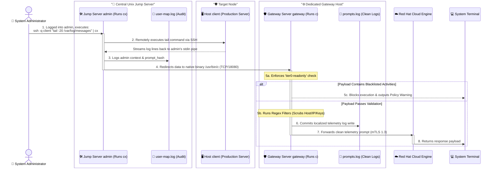

```mermaid
sequenceDiagram
    actor AdminUser as 👤 System Administrator
    
    box "🚀 Central Unix Jump Server"
        participant admin as 🛠️ Jump Server admin (Runs cx)
        participant Log1 as 📝 user-map.log (Audit)
    end

    box "🛡️ Target Node"
        participant client as 🖥️ Host client (Production Server)
    end
    
    box "⚙️ Dedicated Gateway Host"
        participant gateway as 🛡️ Gateway Server gateway (Runs c)
        participant Log2 as 📝 prompts.log (Clean Logs)
    end
    
    participant Cloud as ☁️ Red Hat Cloud Engine
    participant Term as 💻 System Terminal

    %% Step 1 lands directly on admin, because that's where the user is logged in
    AdminUser->>admin: 1. Logged into admin, executes:<br>ssh -q client "tail -20 /var/log/messages" | cx
    activate admin
    
    %% admin then triggers the remote execution over to the client
    admin->>client: 2. Remotely executes tail command via SSH
    client-->>admin: Streams log lines back to admin's stdin pipe
    
    admin->>Log1: 3. Logs admin context & prompt_hash
    admin->>gateway: 4. Redirects data to native binary /usr/bin/c (TCP/18080)
    deactivate admin
    
    activate gateway
    Note over gateway: 5a. Enforces 'tier0-readonly' check
    
    alt Payload Contains Blacklisted Activities
        gateway-->>Term: 5c. Blocks execution & outputs Policy Warning
    else Payload Passes Validation
        Note over gateway: 5b. Runs Regex Filters (Scrubs Host/IP/Keys)
        gateway->>Log2: 6. Commits localized telemetry log write
        gateway->>Cloud: 7. Forwards clean telemetry prompt (mTLS 1.3)
        deactivate gateway
        
        activate Cloud
        Cloud->>Term: 8. Returns response payload
        deactivate Cloud
    end
```
