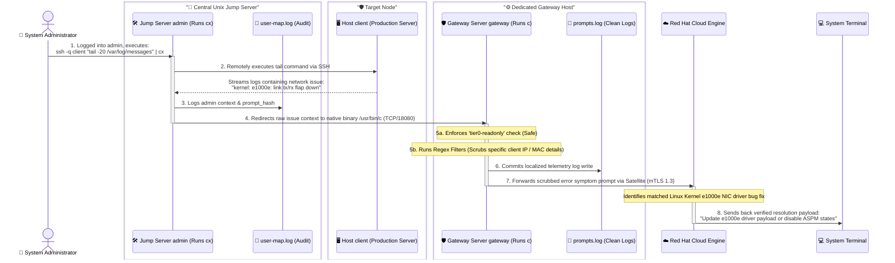

```mermaid
sequenceDiagram
    actor AdminUser as 👤 System Administrator
    
    box "🚀 Central Unix Jump Server"
        participant admin as 🛠️ Jump Server admin (Runs cx)
        participant Log1 as 📝 user-map.log (Audit)
    end

    box "🛡️ Target Node"
        participant client as 🖥️ Host client (Production Server)
    end
    
    box "⚙️ Dedicated Gateway Host"
        participant gateway as 🛡️ Gateway Server gateway (Runs c)
        participant Log2 as 📝 prompts.log (Clean Logs)
    end
    
    participant Cloud as ☁️ Red Hat Cloud Engine
    participant Term as 💻 System Terminal

    %% Step 1: User enters command looking for an active connection dropping issue
    AdminUser->>admin: 1. Logged into admin, executes:<br>ssh -q client "tail -20 /var/log/messages" | cx
    activate admin
    
    %% Step 2: The logs are pulled and reveal a core network drop error
    admin->>client: 2. Remotely executes tail command via SSH
    client-->>admin: Streams logs containing network issue:<br>"kernel: e1000e: link tx/rx flap down"
    
    admin->>Log1: 3. Logs admin context & prompt_hash
    admin->>gateway: 4. Redirects raw issue context to native binary /usr/bin/c (TCP/18080)
    deactivate admin
    
    activate gateway
    Note over gateway: 5a. Enforces 'tier0-readonly' check (Safe)
    Note over gateway: 5b. Runs Regex Filters (Scrubs specific client IP / MAC details)
    gateway->>Log2: 6. Commits localized telemetry log write
    gateway->>Cloud: 7. Forwards scrubbed error symptom prompt via Satellite (mTLS 1.3)
    deactivate gateway
    
    activate Cloud
    Note over Cloud: Identifies matched Linux Kernel e1000e NIC driver bug fix
    Cloud->>Term: 8. Sends back verified resolution payload:<br>"Update e1000e driver payload or disable ASPM states"
    deactivate Cloud
```
