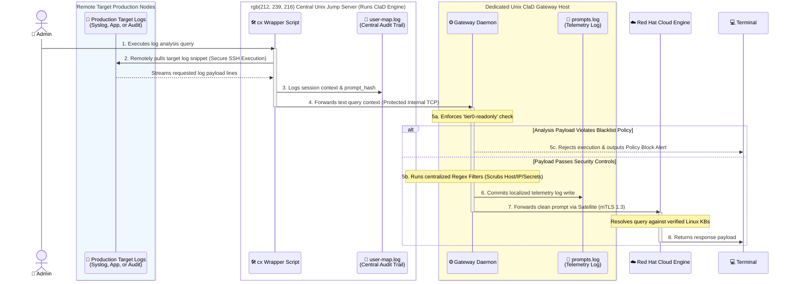

```mermaid
sequenceDiagram
    actor Admin as 👤 Admin
    box rgb(240, 248, 255) Remote Target Production Nodes
        participant NodeLog as 📝 Production Target Logs<br>(Syslog, App, or Audit)
    end
    box rgb(212, 239, 216) Central Unix Jump Server (Runs ClaD Engine)
        participant Wrapper as 🛠️ cx Wrapper Script
        participant Log1 as 📝 user-map.log<br>(Central Audit Trail)
    end
    box rgb(254, 251, 216) Dedicated Unix ClaD Gateway Host
        participant Daemon as ⚙️ Gateway Daemon
        participant Log2 as 📝 prompts.log<br>(Telemetry Log)
    end
    participant Cloud as ☁️ Red Hat Cloud Engine
    participant Term as 💻 Terminal

    Admin->>Wrapper: 1. Executes log analysis query
    activate Wrapper
    
    %% Automated Secure Pull Mechanism
    Wrapper->>NodeLog: 2. Remotely pulls target log snippet (Secure SSH Execution)
    NodeLog-->>Wrapper: Streams requested log payload lines
    
    Wrapper->>Log1: 3. Logs session context & prompt_hash
    Wrapper->>Daemon: 4. Forwards text query context (Protected Internal TCP)
    deactivate Wrapper
    
    activate Daemon
    Note over Daemon: 5a. Enforces 'tier0-readonly' check
    
    alt Analysis Payload Violates Blacklist Policy
        Daemon-->>Term: 5c. Rejects execution & outputs Policy Block Alert
    else Payload Passes Security Controls
        Note over Daemon: 5b. Runs centralized Regex Filters (Scrubs Host/IP/Secrets)
        Daemon->>Log2: 6. Commits localized telemetry log write
        Daemon->>Cloud: 7. Forwards clean prompt via Satellite (mTLS 1.3)
        deactivate Daemon
        
        activate Cloud
        Note over Cloud: Resolves query against verified Linux KBs
        Cloud->>Term: 8. Returns response payload
        deactivate Cloud
    end
```
